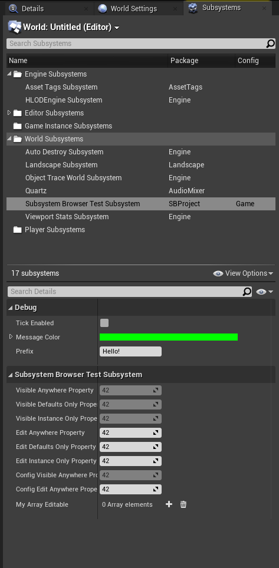
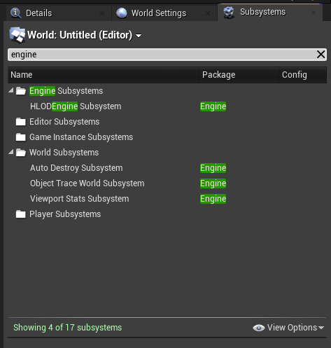
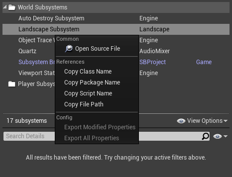
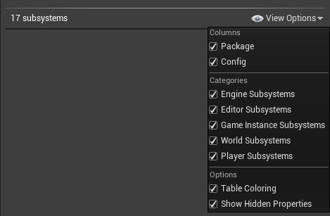

## Subsystem Browser Plugin for Unreal Engine

Subsystems provide an easy way to extend engine functionality and implement new features while avoiding the complexity of overriding engine classes or packing multiple independent features into a single class.
Check [Programming Subsystems](https://dev.epicgames.com/documentation/en-us/unreal-engine/programming-subsystems-in-unreal-engine) article if you haven't tried them yet.

With Subsystems being a great tool, Unreal Engine Editor does not have a default method to visualize them or allow changing their properties at runtime.

Plugin provides a dedicated Subsystem Browser panel to display active subsystems with property editor.

New Subsystem Settings panel provides an easy way to interact with config properties within Subsystem-derived classes without need to create a standalone UDeveloperSettings class.

## Key Features

 * List of all avaiable subsystem types with search bar and customizable filters
   * Engine Subsystems
   * Editor Subsystems
   * Game Instance Subsystems
   * World Subsystems
   * Local Player Subsystems  
   * Audio Engine Subsystems  (UE 5.2+)
 * Display active subsystems in selected worlds
 * Display which module or plugin subsystems originate from
 * View and modify subsystem properties with Details View (including hidden properties)
 * Quick navigation to source file via "Open Source File" context menu action
 * Quick actions to work with ini config settings via "Export Config", "Export to Defaults" context menu actions
 * Browser panel state (chosen filters, category folders state) is saved to local editor settings
 * Support for custom categories: 
 * Support for custom table colums: 
 * Support for custom tooltips: 
 * Various  for Subsystem classes
 * Subsystem Settings Panel to interact with config properties.
 
## Unreal Engine Versions

Plugin compatible with 4.25-4.27, 5.0+, ue5-main and can be easily modified to work with other engine versions.

## Contributing

Please report any issues with GitHub Issues page for this repository.

If you want to suggest changes, improvements or updates to the plugin open new GitHub Issue requesting them or Pull Request.

## License

SubsystemBrowserPlugin is available under the MIT license. See the LICENSE file for more info.

---

Special Thanks to Unreal Source Community Discord and #cpp 
